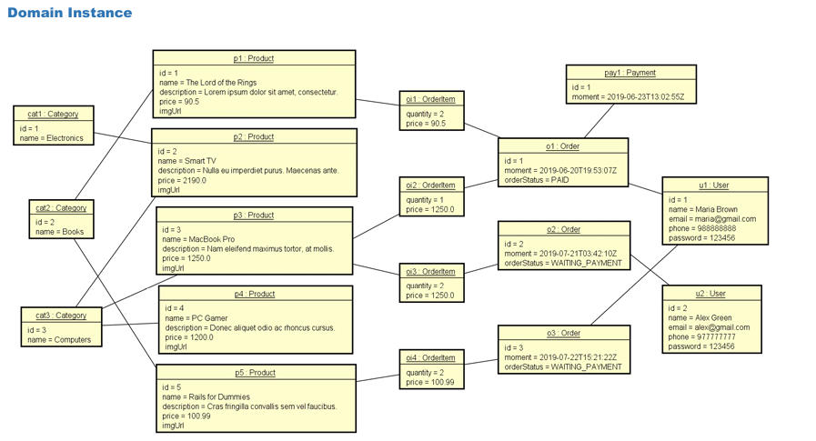

# 📦 Projeto de Ordem de Pedidos com JPA  

## 📖 Sobre o Projeto  
Este projeto é uma API RESTful desenvolvida com Spring Boot e JPA para gerenciar pedidos, produtos e usuários. Ele permite o cadastro, consulta e processamento de pedidos em uma loja online.  

## 🚀 Tecnologias Utilizadas  
- ☕ **Java 17**  
- 🌱 **Spring Framework 3**  
- 🛢️ **Banco de Dados: MySQL 8**  

## 🛠️ Configuração do Ambiente  

### 1️⃣ 📥 Clone o repositório  
```sh  
git clone https://github.com/LucasAndrade131/springboot-jpa.git  
cd springboot-jpa  
```  

### 2️⃣ ⚙️ Configure o ambiente  
- Certifique-se de ter o [Java 17](https://www.oracle.com/java/technologies/javase/jdk17-archive-downloads.html) instalado.  
- Instale o [Maven](https://maven.apache.org/download.cgi) se ainda não estiver configurado.  
- Configure o MySQL com as credenciais corretas no arquivo `application.properties`.  

### 3️⃣ ▶️ Execute o projeto  
Para rodar a aplicação, utilize o Maven:  
```sh  
mvn spring-boot:run  
```  
O projeto estará disponível em [`http://localhost:8080`](http://localhost:8080) 🌍  

## 📸 Visão Geral do Projeto  
Aqui está uma visão da estrutura do domínio do sistema:  

  

## 📚 Referências  
- [📜 Documentação do Spring](https://docs.spring.io/spring-framework/docs/current/reference/html/)  
- [📌 Guia do Spring MVC](https://docs.spring.io/spring-framework/docs/current/reference/html/web.html)  

## ✉️ Contato  
📧 Para dúvidas ou sugestões, entre em contato: **lucas.andrade.tecnologia@gmail.com**  
```
